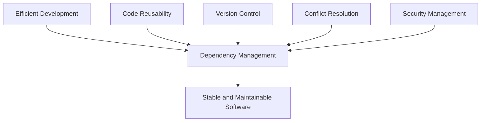
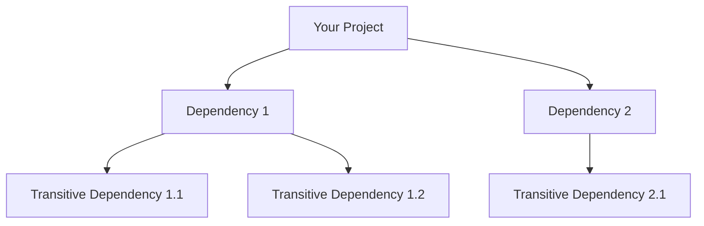

# Lecture 4: Dependency Management Fundamentals

## 1. Introduction to Dependency Management 🔗

Dependency management is a crucial aspect of modern software development, involving the process of declaring, resolving, and using external libraries or modules that a project depends on.

### Key Concepts:
- 📦 **Dependencies**: External code libraries that a project relies on
- 🔄 **Versioning**: System for identifying and managing different versions of dependencies
- 🧩 **Dependency Resolution**: Process of determining which versions of dependencies to use
- 🔒 **Lockfiles**: Files that record the exact versions of dependencies used in a project

## 2. Importance of Dependency Management 🎯



1. **Efficiency**: Avoid reinventing the wheel by leveraging existing libraries
2. **Consistency**: Ensure all developers use the same versions of dependencies
3. **Reproducibility**: Guarantee that builds are reproducible across different environments
4. **Security**: Easily update dependencies to patch security vulnerabilities
5. **Scalability**: Manage complex dependency trees in large projects

## 3. Semantic Versioning (SemVer) 🔢

Semantic Versioning is a versioning scheme that aims to convey meaning about the underlying changes in a version.

### 3.1 SemVer Format:
```
MAJOR.MINOR.PATCH
```
- **MAJOR**: Incompatible API changes
- **MINOR**: Backwards-compatible functionality additions
- **PATCH**: Backwards-compatible bug fixes

### 3.2 SemVer Examples:
- 1.0.0: Initial release
- 1.1.0: New feature added
- 1.1.1: Bug fix
- 2.0.0: Breaking change

### 3.3 Version Ranges:
- Exact: `1.2.3`
- Greater than: `>1.2.3`
- Compatible changes: `^1.2.3` (1.2.3 <= x < 2.0.0)
- Minor changes: `~1.2.3` (1.2.3 <= x < 1.3.0)

## 4. Dependency Management in JavaScript/TypeScript Projects 🌐

### 4.1 NPM (Node Package Manager)

NPM is the default package manager for Node.js and is widely used in JavaScript/TypeScript projects.

#### Key NPM Commands:
- `npm init`: Initialize a new project
- `npm install <package>`: Install a package
- `npm update`: Update packages
- `npm audit`: Check for vulnerabilities

### 4.2 Package.json

The `package.json` file is the heart of any Node.js project, defining project metadata and dependencies.

Example `package.json`:
```json
{
  "name": "my-project",
  "version": "1.0.0",
  "dependencies": {
    "express": "^4.17.1",
    "lodash": "^4.17.21"
  },
  "devDependencies": {
    "jest": "^27.0.6"
  }
}
```

### 4.3 Package-lock.json

The `package-lock.json` file locks the versions of installed packages and their dependencies, ensuring reproducibility.

## 5. Dependency Management in Python Projects 🐍

### 5.1 pip

pip is the package installer for Python, used to install packages from the Python Package Index (PyPI).

#### Key pip Commands:
- `pip install <package>`: Install a package
- `pip freeze`: Output installed packages in requirements format
- `pip install -r requirements.txt`: Install from a requirements file

### 5.2 requirements.txt

The `requirements.txt` file lists the dependencies for a Python project.

Example `requirements.txt`:
```
Flask==2.0.1
requests>=2.25.1,<3.0.0
```

### 5.3 Poetry

Poetry is a modern dependency management tool for Python, offering more features than pip.

Example `pyproject.toml` (used by Poetry):
```toml
[tool.poetry]
name = "my-project"
version = "0.1.0"

[tool.poetry.dependencies]
python = "^3.9"
requests = "^2.25.1"

[tool.poetry.dev-dependencies]
pytest = "^6.2.4"
```

## 6. Dependency Scopes in Modern Frameworks 🔍

Dependencies can be categorized into different scopes based on when and where they are needed.

### 6.1 Common Dependency Scopes:
1. **Production Dependencies**: Required to run the application in production
2. **Development Dependencies**: Needed for development and testing, but not in production
3. **Peer Dependencies**: Required to be provided by the consumer of your package
4. **Optional Dependencies**: Enhance functionality but are not required

### 6.2 Example in package.json:
```json
{
  "dependencies": {
    "express": "^4.17.1"
  },
  "devDependencies": {
    "jest": "^27.0.6"
  },
  "peerDependencies": {
    "react": "^17.0.2"
  },
  "optionalDependencies": {
    "color": "^3.1.3"
  }
}
```

## 7. Transitive Dependencies 🌳

Transitive dependencies are dependencies of your direct dependencies.

### 7.1 Dependency Tree


### 7.2 Challenges with Transitive Dependencies:
1. **Version Conflicts**: Different dependencies may require different versions of the same transitive dependency
2. **Security Vulnerabilities**: Vulnerabilities can be introduced through transitive dependencies
3. **Bloat**: Unnecessary transitive dependencies can increase project size

### 7.3 Managing Transitive Dependencies:
- Use lockfiles to freeze all dependency versions
- Regularly update and audit dependencies
- Use tools like `npm-check` or `pip-audit` to analyze dependency trees

## 8. Dependency Resolution Algorithms 🧮

Dependency managers use algorithms to resolve complex dependency graphs and determine which versions to install.

### 8.1 NPM's Resolution Algorithm:
1. Construct a dependency graph
2. Duplicate packages to avoid version conflicts
3. Flatten the graph as much as possible

### 8.2 Poetry's Resolution Algorithm:
1. Build a dependency graph
2. Use an SAT solver to find a valid combination of package versions
3. Optimize for the latest versions that satisfy all constraints

## 9. Best Practices in Dependency Management 🌟

1. **Keep Dependencies Updated**: Regularly update to get bug fixes and security patches
2. **Use Lockfiles**: Ensure consistency across all environments
3. **Audit Dependencies**: Regularly check for known vulnerabilities
4. **Minimize Dependencies**: Only include what you need to reduce complexity
5. **Use Version Ranges Wisely**: Balance flexibility and stability
6. **Document Dependencies**: Clearly specify why each dependency is needed
7. **Monitor License Compliance**: Ensure all dependencies have compatible licenses

## 10. Practical Exercise: Managing Dependencies in a Full-Stack Project 🛠️

### Task:
Set up and manage dependencies for a full-stack web application using Node.js (Express) for the backend and React for the frontend.

### Steps:
1. Initialize a new Node.js project
2. Set up an Express.js server with necessary dependencies
3. Create a React frontend using Create React App
4. Manage development dependencies for testing (Jest, React Testing Library)
5. Use a monorepo structure with Yarn Workspaces
6. Implement strategies to handle common dependency issues

### Sample Project Structure:
```
my-fullstack-app/
├── package.json
├── yarn.lock
├── packages/
│   ├── server/
│   │   ├── package.json
│   │   └── src/
│   └── client/
│       ├── package.json
│       └── src/
└── README.md
```

## 11. Conclusion and Next Steps 🎓

Effective dependency management is crucial for building stable, secure, and maintainable software. As projects grow in complexity, mastering dependency management becomes increasingly important. In our next lecture, we'll explore advanced dependency management techniques and dive deeper into package registries.

### Review Questions:
1. Explain the importance of semantic versioning in dependency management.
2. How do lockfiles contribute to project stability and reproducibility?
3. What are the main challenges associated with transitive dependencies?
4. Compare and contrast dependency management in JavaScript and Python ecosystems.

### Further Reading:
- "Mastering JavaScript Dependencies" by Sufyan bin Uzayr
- "Python Packaging User Guide" (https://packaging.python.org/)
- "Dependency Hell" article on Wikipedia for historical context

In our next lecture, we'll explore "Advanced Dependency Management and Package Registries," building on the fundamentals we've covered today.
