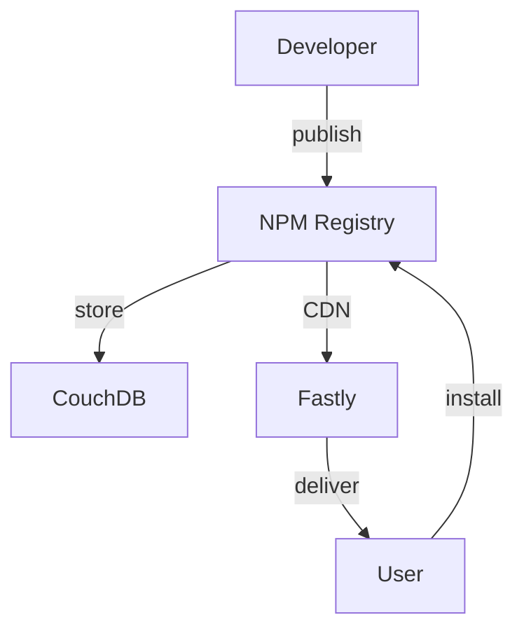

# Lecture 5: Advanced Dependency Management and Package Registries

## 1. Introduction to Advanced Dependency Management 🚀

Building on our understanding of dependency management fundamentals, this lecture explores advanced techniques and concepts, including package registries, monorepo management, and strategies for handling complex dependency scenarios.

### Key Topics:
- 📦 Package Registries
- 🏗️ Monorepo Management
- 🔍 Advanced Dependency Resolution
- 🛡️ Security in Dependency Management
- 🔄 Continuous Dependency Updates

## 2. Package Registries Deep Dive 📚

Package registries are centralized repositories for storing and distributing software packages.

### 2.1 Types of Package Registries:

1. **Public Registries**:
   - npm (for JavaScript)
   - PyPI (for Python)
   - Maven Central (for Java)

2. **Private Registries**:
   - JFrog Artifactory
   - Nexus Repository
   - GitHub Packages

3. **Hybrid Approaches**:
   - npm Enterprise
   - GitLab Package Registry

### 2.2 NPM Registry Architecture



## 3. Setting Up and Using Private Registries 🔒

Private registries offer enhanced security and control over your packages.

### 3.1 Setting Up a Private NPM Registry with Verdaccio:

```bash
# Install Verdaccio
npm install -g verdaccio

# Start Verdaccio
verdaccio

# Configure npm to use the private registry
npm set registry http://localhost:4873/

# Publish a package to the private registry
npm publish --registry http://localhost:4873/
```

### 3.2 Configuring npm to Use Multiple Registries:

Create a `.npmrc` file in your project root:

```ini
registry=https://registry.npmjs.org/
@mycompany:registry=http://localhost:4873/
```

This configuration uses the public npm registry by default, but uses the private registry for packages under the `@mycompany` scope.

## 4. Monorepo Management 🏢

Monorepos are single repositories containing multiple related projects.

### 4.1 Benefits of Monorepos:
- Simplified dependency management
- Atomic commits across projects
- Easier code sharing and refactoring

### 4.2 Tools for Monorepo Management:
1. **Lerna**: Optimizes the workflow around managing multi-package repositories with git and npm.
2. **Yarn Workspaces**: Allows you to set up multiple packages in such a way that you only need to run yarn install once to install all of them in a single pass.
3. **NX**: Extensible dev tools for monorepos, which focuses on full-stack development.

### 4.3 Example Lerna Configuration:

```json
{
  "packages": ["packages/*"],
  "version": "independent",
  "npmClient": "yarn",
  "useWorkspaces": true
}
```

## 5. Advanced Dependency Resolution Strategies 🧩

### 5.1 Resolving Version Conflicts:
- **NPM's Nested Dependencies**: npm installs conflicting versions in nested node_modules.
- **Yarn's Flat Mode**: Attempts to resolve to a single version of each package.

### 5.2 Peer Dependencies:
Used when your package needs a dependency to be available but doesn't want to bundle it directly.

```json
{
  "name": "my-plugin",
  "version": "1.0.0",
  "peerDependencies": {
    "host-package": "^2.0.0"
  }
}
```

### 5.3 Optional Dependencies:
Dependencies that are not required for the main functionality.

```json
{
  "optionalDependencies": {
    "color": "^3.0.0"
  }
}
```

## 6. Dependency Hell and How to Avoid It 😈➡️😇

Dependency Hell refers to the frustration of dealing with complex, conflicting, or problematic dependencies.

### 6.1 Common Causes:
1. Conflicting version requirements
2. Deep dependency trees
3. Outdated or unmaintained dependencies

### 6.2 Strategies to Avoid Dependency Hell:
1. Use lockfiles (`package-lock.json`, `yarn.lock`)
2. Regularly update dependencies
3. Minimize the number of dependencies
4. Use dependency visualization tools (e.g., `npm ls`, `yarn why`)

## 7. Continuous Dependency Updates 🔄

Keeping dependencies up-to-date is crucial for security and performance.

### 7.1 Tools for Automated Updates:
1. **Dependabot**: Automatically opens pull requests to update dependencies.
2. **Renovate**: Similar to Dependabot, but with more customization options.
3. **npm-check-updates**: CLI tool to upgrade package.json dependencies.

### 7.2 Example Dependabot Configuration:

```yaml
version: 2
updates:
  - package-ecosystem: "npm"
    directory: "/"
    schedule:
      interval: "weekly"
    open-pull-requests-limit: 10
```

## 8. Security in Dependency Management 🛡️

### 8.1 Common Security Issues:
1. Known vulnerabilities in dependencies
2. Malicious packages
3. Dependency confusion attacks

### 8.2 Best Practices:
1. Regularly run security audits (`npm audit`, `yarn audit`)
2. Use tools like Snyk or WhiteSource Renovate
3. Implement proper access controls for private registries
4. Use package signing and verification

### 8.3 Example: Running npm audit

```bash
npm audit

# To fix vulnerabilities automatically
npm audit fix
```

## 9. Advanced NPM Features 🔧

### 9.1 NPM Scripts:
Automate common tasks using npm scripts in package.json.

```json
{
  "scripts": {
    "start": "node server.js",
    "test": "jest",
    "lint": "eslint .",
    "build": "webpack"
  }
}
```

### 9.2 NPM Hooks:
Scripts that run at specific times in the package lifecycle.

```json
{
  "scripts": {
    "preinstall": "echo 'About to install dependencies'",
    "postinstall": "node post-install-script.js"
  }
}
```

## 10. Dependency Management in Different Ecosystems 🌐

### 10.1 Java: Maven and Gradle

Maven uses `pom.xml` for dependency declaration:

```xml
<dependencies>
  <dependency>
    <groupId>org.springframework.boot</groupId>
    <artifactId>spring-boot-starter-web</artifactId>
    <version>2.5.2</version>
  </dependency>
</dependencies>
```

### 10.2 Ruby: Bundler

Bundler uses a `Gemfile` for dependency management:

```ruby
source 'https://rubygems.org'

gem 'rails', '~> 6.1.0'
gem 'pg', '~> 1.2.3'
```

### 10.3 .NET: NuGet

NuGet uses a `packages.config` or project file for dependencies:

```xml
<ItemGroup>
  <PackageReference Include="Newtonsoft.Json" Version="13.0.1" />
</ItemGroup>
```

## 11. Practical Exercise: Advanced Dependency Management in a Monorepo 🛠️

### Task:
Set up a monorepo for a full-stack application with shared dependencies, implement automated updates, and configure a private registry.

### Steps:
1. Initialize a monorepo using Lerna and Yarn Workspaces
2. Create packages for backend (Node.js), frontend (React), and shared utilities
3. Set up a private npm registry using Verdaccio
4. Implement Dependabot for automated dependency updates
5. Create npm scripts for common tasks across all packages
6. Resolve a simulated version conflict between packages

### Sample Monorepo Structure:
```
my-monorepo/
├── lerna.json
├── package.json
├── packages/
│   ├── backend/
│   │   ├── package.json
│   │   └── src/
│   ├── frontend/
│   │   ├── package.json
│   │   └── src/
│   └── shared/
│       ├── package.json
│       └── src/
├── .github/
│   └── dependabot.yml
└── README.md
```

## 12. Conclusion and Next Steps 🎓

Advanced dependency management is crucial for maintaining large-scale projects and ensuring their long-term health and security. As the software ecosystem continues to evolve, staying updated with the latest tools and best practices in dependency management will be key to successful software development.

### Review Questions:
1. How do private package registries enhance security in dependency management?
2. Explain the benefits and challenges of using a monorepo structure for managing dependencies.
3. What strategies can be employed to mitigate "dependency hell" in large projects?
4. How do continuous dependency update tools improve project maintenance and security?

### Further Reading:
- "Monorepo Tools" by Nrwl (https://nx.dev/latest/react/core-concepts/why-monorepos)
- "Securing the Supply Chain" by GitHub (https://resources.github.com/security/secure-software-development/)
- "The npm Blog" for latest updates and best practices (https://blog.npmjs.org/)

In our next lecture, we'll explore "Documentation and Reporting in Modern Development," focusing on how to effectively document and communicate about our projects and dependencies.
