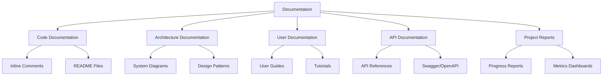

# Lecture 6: Documentation and Reporting in Modern Development

## 1. Introduction to Documentation in Software Development 📚

Documentation is a crucial aspect of software development that often doesn't receive the attention it deserves. Good documentation can significantly improve project maintainability, onboarding of new team members, and overall software quality.

### Key Aspects of Documentation:
- 📝 Code documentation
- 🗺️ Architecture documentation
- 👤 User documentation
- 🧪 API documentation
- 📊 Project reports and metrics

## 2. Types of Documentation 📑



### 2.1 Code Documentation
- **Purpose**: Explain the 'why' behind the code
- **Tools**: JSDoc, Docstrings, README files

### 2.2 Architecture Documentation
- **Purpose**: Describe system structure and design decisions
- **Tools**: UML diagrams, Architecture Decision Records (ADRs)

### 2.3 User Documentation
- **Purpose**: Help end-users understand and use the software
- **Types**: User guides, tutorials, FAQs

### 2.4 API Documentation
- **Purpose**: Describe how to interact with an API
- **Tools**: Swagger/OpenAPI, API Blueprint

### 2.5 Project Reports
- **Purpose**: Communicate project status and metrics
- **Types**: Progress reports, quality metrics, performance dashboards

## 3. Documentation as Code 🖥️

Documentation as Code is an approach where documentation is treated with the same practices as code development.

### 3.1 Principles:
1. Version control for documentation
2. Review processes for docs (like code reviews)
3. Automated testing of documentation
4. Continuous Integration/Deployment for docs

### 3.2 Tools for Documentation as Code:
- **Markdown**: Lightweight markup language
- **AsciiDoc**: More feature-rich than Markdown
- **Sphinx**: Documentation generator, popular in Python projects
- **Jekyll**: Static site generator, often used with GitHub Pages

### 3.3 Example: Markdown Documentation

```markdown
# Project Title

## Installation

To install the project, run:

```bash
npm install my-project
```

## Usage

Here's a simple example:

```javascript
const myProject = require('my-project');
myProject.doSomething();
```
```

## 4. API Documentation with Swagger/OpenAPI 🔄

Swagger (now the OpenAPI Specification) is a powerful tool for designing, building, and documenting RESTful APIs.

### 4.1 Benefits of Swagger/OpenAPI:
- Interactive documentation
- Code generation
- Testing tools integration

### 4.2 Example Swagger YAML:

```yaml
openapi: 3.0.0
info:
  title: Sample API
  version: 1.0.0
paths:
  /users:
    get:
      summary: Returns a list of users
      responses:
        '200':
          description: Successful response
          content:
            application/json:    
              schema:
                type: array
                items:
                  type: object
                  properties:
                    id:
                      type: integer
                    name:
                      type: string
```

## 5. Automated Documentation Generation 🤖

Automated documentation tools can generate documentation from code comments and structure.

### 5.1 Popular Tools:
- **JSDoc**: For JavaScript
- **Sphinx**: For Python
- **Javadoc**: For Java
- **Doxygen**: Multi-language support

### 5.2 Example: JSDoc Comment

```javascript
/**
 * Calculates the sum of two numbers.
 *
 * @param {number} a - The first number.
 * @param {number} b - The second number.
 * @returns {number} The sum of a and b.
 */
function sum(a, b) {
    return a + b;
}
```

## 6. Documentation Best Practices 🌟

1. **Keep it Updated**: Outdated documentation is often worse than no documentation
2. **Be Concise**: Use clear, simple language
3. **Use Examples**: Provide code samples and use cases
4. **Structure Well**: Use consistent formatting and organization
5. **Include Visuals**: Diagrams and screenshots can clarify complex concepts
6. **Consider the Audience**: Tailor the content to the intended readers
7. **Link Related Docs**: Cross-reference related documentation
8. **Version Your Docs**: Align documentation versions with software versions

## 7. Docusaurus for Documentation Sites 🦖

Docusaurus is a popular tool for creating documentation websites.

### 7.1 Key Features:
- Built on React
- Supports Markdown and MDX
- Versioning support
- Search functionality
- Customizable theming

### 7.2 Basic Docusaurus Setup:

```bash
npx @docusaurus/init@latest init my-docs classic
cd my-docs
npm start
```

## 8. Reporting in Modern Development 📊

Reporting provides insights into project status, quality, and performance.

### 8.1 Types of Reports:
1. **Progress Reports**: Sprint/milestone completion status
2. **Quality Reports**: Code coverage, linting results, test pass rates
3. **Performance Reports**: Application performance metrics
4. **Security Reports**: Vulnerability scans, dependency checks

### 8.2 Automated Reporting Tools:
- **SonarQube**: Code quality and security
- **Jest**: JavaScript testing and coverage reporting
- **Codecov**: Code coverage reporting
- **Datadog**: Application performance monitoring and reporting

## 9. Advanced Reporting with Datadog 🐶

Datadog is a monitoring and analytics platform that can provide deep insights into application performance and user behavior.

### 9.1 Key Features:
- Real-time metrics
- Log management
- Application Performance Monitoring (APM)
- User behavior analytics
- Customizable dashboards

### 9.2 Example Datadog Dashboard Configuration:

```yaml
layout_type: ordered
title: Application Overview
widgets:
  - definition:
      title: Requests per second
      type: timeseries
      query: avg:nginx.net.request_per_s{*}
  - definition:
      title: Error rate
      type: query_value
      query: avg:nginx.net.http_5xx{*}
  - definition:
      title: Average response time
      type: timeseries
      query: avg:nginx.net.request_time{*}
```

## 10. New Relic for Application Performance Monitoring 🆕

New Relic is another powerful tool for application monitoring and reporting.

### 10.1 Key Capabilities:
- Real-time performance metrics
- Error tracking and alerts
- Distributed tracing
- Infrastructure monitoring
- Custom dashboards and reports

### 10.2 Example New Relic Agent Configuration (Node.js):

```javascript
'use strict'

exports.config = {
  app_name: ['My Application'],
  license_key: 'your_license_key_here',
  logging: {
    level: 'info'
  },
  allow_all_headers: true,
  attributes: {
    exclude: [
      'request.headers.cookie',
      'request.headers.authorization',
      'request.headers.proxyAuthorization',
      'request.headers.setCookie*',
      'request.headers.x*',
      'response.headers.cookie',
      'response.headers.authorization',
      'response.headers.proxyAuthorization',
      'response.headers.setCookie*',
      'response.headers.x*'
    ]
  }
}
```

## 11. Practical Exercise: Comprehensive Documentation and Reporting Setup 🛠️

### Task:
Set up a documentation site and implement automated reporting for a web application project.

### Steps:
1. Initialize a Docusaurus site for project documentation
2. Write API documentation using Swagger/OpenAPI
3. Implement JSDoc comments in the codebase
4. Set up automated documentation generation in CI/CD pipeline
5. Configure SonarQube for code quality reporting
6. Implement Datadog for application performance monitoring
7. Create a custom dashboard in Datadog or New Relic
8. Write a script to generate weekly progress reports

### Sample Docusaurus Configuration:

```javascript
module.exports = {
  title: 'My Project Docs',
  tagline: 'Comprehensive documentation for My Project',
  url: 'https://myproject.com',
  baseUrl: '/',
  onBrokenLinks: 'throw',
  onBrokenMarkdownLinks: 'warn',
  favicon: 'img/favicon.ico',
  organizationName: 'myorg',
  projectName: 'my-project',
  themeConfig: {
    navbar: {
      title: 'My Project',
      logo: {
        alt: 'My Project Logo',
        src: 'img/logo.svg',
      },
      items: [
        {
          type: 'doc',
          docId: 'intro',
          position: 'left',
          label: 'Tutorial',
        },
        {to: '/blog', label: 'Blog', position: 'left'},
        {
          href: 'https://github.com/myorg/my-project',
          label: 'GitHub',
          position: 'right',
        },
      ],
    },
    footer: {
      style: 'dark',
      links: [
        {
          title: 'Docs',
          items: [
            {
              label: 'Tutorial',
              to: '/docs/intro',
            },
          ],
        },
        {
          title: 'Community',
          items: [
            {
              label: 'Stack Overflow',
              href: 'https://stackoverflow.com/questions/tagged/myproject',
            },
          ],
        },
      ],
      copyright: `Copyright © ${new Date().getFullYear()} My Project, Inc. Built with Docusaurus.`,
    },
  },
  presets: [
    [
      '@docusaurus/preset-classic',
      {
        docs: {
          sidebarPath: require.resolve('./sidebars.js'),
          editUrl:
            'https://github.com/myorg/my-project/edit/main/website/',
        },
        blog: {
          showReadingTime: true,
          editUrl:
            'https://github.com/myorg/my-project/edit/main/website/blog/',
        },
        theme: {
          customCss: require.resolve('./src/css/custom.css'),
        },
      },
    ],
  ],
};
```

## 12. Conclusion and Next Steps 🎓

Effective documentation and reporting are essential for maintaining and scaling software projects. They facilitate knowledge sharing, improve code quality, and provide valuable insights into project health and performance. As we move towards more complex and distributed systems, the importance of clear, up-to-date documentation and comprehensive reporting will only increase.

### Review Questions:
1. How does the "Documentation as Code" approach improve the documentation process?
2. What are the key differences between user documentation and API documentation?
3. How can automated documentation generation tools improve developer productivity?
4. Explain the benefits of using application performance monitoring tools like Datadog or New Relic.

### Further Reading:
- "Living Documentation" by Cyrille Martraire
- "Docs Like Code" by Anne Gentle
- "The Documentation System" by Divio (https://documentation.divio.com/)
- "Web API Design" by Brian Mulloy (Apigee)

In our next and final lecture, we'll explore "Testing and Code Coverage in Modern Development," focusing on how to ensure the quality and reliability of our software through comprehensive testing strategies.
