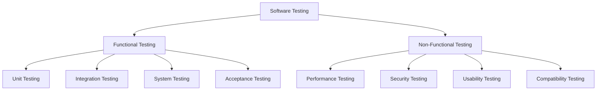

# Lecture 7: Testing and Code Coverage in Modern Development

## 1. Introduction to Software Testing 🧪

Software testing is a critical process in software development that ensures the quality, reliability, and performance of applications. It involves executing a program with the intent of finding errors and verifying that it meets specified requirements.

### Key Concepts in Testing:
- 🐛 Bug detection and prevention
- ✅ Verification of functionality
- 🔍 Validation of requirements
- 🚀 Performance assessment
- 🔒 Security evaluation

## 2. Types of Software Testing 📊



### 2.1 Functional Testing
- **Unit Testing**: Testing individual components or functions
- **Integration Testing**: Testing interactions between components
- **System Testing**: Testing the entire system as a whole
- **Acceptance Testing**: Verifying if the system meets business requirements

### 2.2 Non-Functional Testing
- **Performance Testing**: Evaluating system performance under various conditions
- **Security Testing**: Identifying vulnerabilities and security flaws
- **Usability Testing**: Assessing user-friendliness and user experience
- **Compatibility Testing**: Ensuring the system works across different environments

## 3. Test-Driven Development (TDD) 🔄

TDD is a software development approach where tests are written before the actual code.

### 3.1 TDD Cycle:
1. Write a failing test
2. Write minimal code to pass the test
3. Refactor the code
4. Repeat

### 3.2 Benefits of TDD:
- Improved code quality
- Better code design and architecture
- Faster debugging
- Built-in regression testing

## 4. Unit Testing in JavaScript and Python 🧩

### 4.1 JavaScript Unit Testing with Jest

Jest is a popular testing framework for JavaScript projects.

#### Example Jest Test:

```javascript
// sum.js
function sum(a, b) {
  return a + b;
}
module.exports = sum;

// sum.test.js
const sum = require('./sum');

test('adds 1 + 2 to equal 3', () => {
  expect(sum(1, 2)).toBe(3);
});
```

### 4.2 Python Unit Testing with PyTest

PyTest is a robust testing framework for Python.

#### Example PyTest:

```python
# test_sum.py
def sum(a, b):
    return a + b

def test_sum():
    assert sum(1, 2) == 3
```

## 5. Integration Testing 🔗

Integration testing verifies that different modules or services work well together.

### 5.1 Approaches to Integration Testing:
- **Big Bang**: Integrate all modules at once
- **Incremental**: Integrate and test modules one by one
- **Sandwich**: Combine top-down and bottom-up approaches

### 5.2 Example: API Integration Test with Supertest (Node.js)

```javascript
const request = require('supertest');
const app = require('../app');

describe('GET /users', function() {
  it('responds with json containing a list of users', function(done) {
    request(app)
      .get('/users')
      .set('Accept', 'application/json')
      .expect('Content-Type', /json/)
      .expect(200, done);
  });
});
```

## 6. Behavior-Driven Development (BDD) 🎭

BDD is an extension of TDD that emphasizes collaboration between developers, QA, and non-technical stakeholders.

### 6.1 BDD Frameworks:
- Cucumber (Multi-language)
- Jasmine (JavaScript)
- Behave (Python)

### 6.2 Example: Cucumber Feature File

```gherkin
Feature: User Login
  Scenario: Successful login
    Given I am on the login page
    When I enter valid credentials
    And I click the login button
    Then I should be redirected to the dashboard
```

## 7. Mocking and Stubbing 🎭

Mocking and stubbing are techniques used in unit testing to isolate the code being tested.

### 7.1 Mocking with Jest

```javascript
const axios = require('axios');
jest.mock('axios');

test('should fetch users', () => {
  const users = [{name: 'Bob'}];
  const resp = {data: users};
  axios.get.mockResolvedValue(resp);

  return getUsers().then(data => expect(data).toEqual(users));
});
```

### 7.2 Mocking with Python's unittest.mock

```python
from unittest.mock import patch
import mymodule

@patch('mymodule.requests.get')
def test_get_users(mock_get):
    mock_get.return_value.json.return_value = {'users': [{'name': 'Bob'}]}
    result = mymodule.get_users()
    assert result == [{'name': 'Bob'}]
```

## 8. Code Coverage 📊

Code coverage is a metric that measures the amount of code executed during your tests.

### 8.1 Types of Code Coverage:
- **Statement Coverage**: Percentage of statements executed
- **Branch Coverage**: Percentage of branches executed
- **Function Coverage**: Percentage of functions called
- **Line Coverage**: Percentage of lines executed

### 8.2 Code Coverage Tools:
- **Istanbul**: For JavaScript projects
- **Coverage.py**: For Python projects

### 8.3 Example: Istanbul Configuration in package.json

```json
{
  "scripts": {
    "test": "jest",
    "coverage": "jest --coverage"
  },
  "jest": {
    "collectCoverage": true,
    "coverageReporters": ["text", "lcov"],
    "coverageThreshold": {
      "global": {
        "branches": 80,
        "functions": 80,
        "lines": 80,
        "statements": 80
      }
    }
  }
}
```

## 9. Continuous Integration and Continuous Testing ⚙️

CI/CD pipelines often include automated testing to ensure code quality before deployment.

### 9.1 Example: GitHub Actions Workflow for Testing

```yaml
name: Node.js CI

on: [push]

jobs:
  build:
    runs-on: ubuntu-latest

    steps:
    - uses: actions/checkout@v2
    - name: Use Node.js
      uses: actions/setup-node@v2
      with:
        node-version: '14.x'
    - run: npm ci
    - run: npm test
    - run: npm run coverage
    - name: Upload coverage to Codecov
      uses: codecov/codecov-action@v1
```

## 10. Performance Testing 🚀

Performance testing ensures that software applications can handle expected loads and respond within acceptable time frames.

### 10.1 Types of Performance Tests:
- **Load Testing**: Testing behavior under normal and peak loads
- **Stress Testing**: Testing behavior under extreme loads
- **Scalability Testing**: Testing how system scales with increasing load
- **Endurance Testing**: Testing system behavior over extended periods

### 10.2 Performance Testing Tools:
- **Apache JMeter**: Open-source load testing tool
- **Gatling**: Scala-based load testing tool
- **Locust**: Python-based load testing tool

### 10.3 Example: Simple Locust Test

```python
from locust import HttpUser, task, between

class WebsiteUser(HttpUser):
    wait_time = between(1, 5)

    @task
    def index_page(self):
        self.client.get("/")

    @task(3)
    def view_item(self):
        item_id = random.randint(1, 10000)
        self.client.get(f"/item?id={item_id}", name="/item")
```

## 11. Security Testing 🔒

Security testing identifies vulnerabilities in software applications that could be exploited by malicious actors.

### 11.1 Types of Security Tests:
- Vulnerability Scanning
- Penetration Testing
- Security Auditing
- Risk Assessment

### 11.2 Security Testing Tools:
- **OWASP ZAP**: Open-source security testing tool
- **Metasploit**: Penetration testing framework
- **Nmap**: Network discovery and security auditing

## 12. Best Practices in Testing 🌟

1. **Write Tests Early**: Embrace test-driven development
2. **Keep Tests Simple**: Each test should focus on one specific behavior
3. **Use Descriptive Test Names**: Clear names help in understanding test purpose
4. **Maintain Test Independence**: Tests should not depend on each other
5. **Avoid Test Duplication**: DRY principle applies to tests too
6. **Regular Test Maintenance**: Keep tests up-to-date with code changes
7. **Continuous Integration**: Run tests automatically on every code change
8. **Monitor Test Performance**: Slow tests can hinder development speed
9. **Use Test Doubles Judiciously**: Overuse of mocks can lead to brittle tests
10. **Code Coverage is Not Everything**: High coverage doesn't guarantee quality

## 13. Practical Exercise: Comprehensive Testing Setup 🛠️

### Task:
Set up a comprehensive testing environment for a web application project, including unit tests, integration tests, and code coverage reporting.

### Steps:
1. Set up a Node.js project with Express for the backend
2. Create a React frontend
3. Implement unit tests for backend using Jest
4. Implement unit tests for frontend using React Testing Library
5. Set up integration tests using Supertest
6. Configure Istanbul for code coverage
7. Implement a simple load test using Locust
8. Set up a CI pipeline using GitHub Actions to run all tests and report coverage

### Sample Test Suite Structure:

```
project/
│
├── backend/
│   ├── src/
│   │   └── app.js
│   └── tests/
│       ├── unit/
│       │   └── user.test.js
│       └── integration/
│           └── api.test.js
│
├── frontend/
│   ├── src/
│   │   └── App.js
│   └── tests/
│       └── App.test.js
│
├── loadtests/
│   └── locustfile.py
│
└── .github/
    └── workflows/
        └── test.yml
```

## 14. Conclusion and Future Trends 🔮

Testing and code coverage are fundamental to ensuring software quality and reliability. As software systems become more complex and distributed, testing strategies will need to evolve. Future trends in testing include:

- AI-powered testing tools
- Increased focus on security testing
- Shift-left testing (moving testing earlier in the development process)
- Testing in production environments
- Chaos engineering for resilience testing

### Review Questions:
1. How does Test-Driven Development differ from traditional development approaches?
2. What are the key differences between unit testing and integration testing?
3. How can code coverage metrics be used effectively in a development process?
4. Explain the importance of continuous testing in modern software development.

### Further Reading:
- "Test Driven Development: By Example" by Kent Beck
- "xUnit Test Patterns: Refactoring Test Code" by Gerard Meszaros
- "Continuous Delivery" by Jez Humble and David Farley
- "The Art of Software Testing" by Glenford J. Myers, Corey Sandler, Tom Badgett

This concludes our series on Build and Release Management. We've covered a wide range of topics from modern build concepts to advanced testing strategies. Remember that these practices and tools are constantly evolving, so continuous learning and adaptation are key to success in this field.
