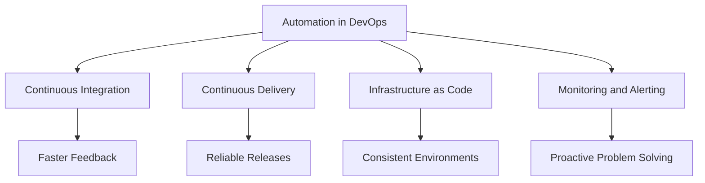

# Lecture 4: Advantages of Automation and Automation Scenarios (Part 1)

## 1. Advantages of Automation (15 minutes) 🌟

### 1.1 Key Benefits of Automation

1. **Increased Efficiency**: Faster execution of tasks
2. **Reduced Human Error**: Consistency in task execution
3. **Cost Savings**: Lower labor costs for repetitive tasks
4. **Scalability**: Easily handle increased workload
5. **Improved Quality**: Consistent and reliable results
6. **24/7 Operations**: Tasks can run around the clock
7. **Faster Time-to-Market**: Accelerated development and deployment cycles

### 1.2 Impact of Automation on DevOps



### 1.3 Challenges in Implementing Automation

1. Initial setup complexity
2. Maintenance of automation scripts
3. Resistance to change
4. Skill gap in automation technologies
5. Balancing automation with human oversight

## 2. Automation Scenarios: Log Management (20 minutes) 📊

### 2.1 Archiving Logs

#### Problem:
Manual log archival is time-consuming and prone to errors.

#### Automation Solution:
```bash
#!/bin/bash
# Log archiving script

# Set variables
LOG_DIR="/var/log"
ARCHIVE_DIR="/backup/logs"
DATE=$(date +%Y%m%d)

# Create archive directory if it doesn't exist
mkdir -p $ARCHIVE_DIR

# Archive logs
find $LOG_DIR -name "*.log" -mtime +7 | xargs tar -czf $ARCHIVE_DIR/logs_$DATE.tar.gz

# Delete old logs
find $LOG_DIR -name "*.log" -mtime +7 -delete

echo "Log archiving completed on $DATE"
```

#### Benefits:
- Consistent log archiving process
- Automated cleanup of old logs
- Easy retrieval of historical logs

### 2.2 Auto-Discard Old Archives

#### Problem:
Accumulation of old log archives can consume excessive storage.

#### Automation Solution:
```bash
#!/bin/bash
# Auto-discard old archives

ARCHIVE_DIR="/backup/logs"
DAYS_TO_KEEP=30

find $ARCHIVE_DIR -name "*.tar.gz" -mtime +$DAYS_TO_KEEP -delete

echo "Old archives older than $DAYS_TO_KEEP days have been removed"
```

#### Benefits:
- Prevents storage overflow
- Maintains relevant historical data
- Reduces manual maintenance effort

## 3. Automation Scenarios: Database Management (20 minutes) 💾

### 3.1 MySQL (RDBMS) Backups

#### Problem:
Manual database backups are time-consuming and can be forgotten.

#### Automation Solution:
```bash
#!/bin/bash
# MySQL backup script

DB_USER="backup_user"
DB_PASS="secure_password"
BACKUP_DIR="/backup/mysql"
DATE=$(date +%Y%m%d)

# Ensure backup directory exists
mkdir -p $BACKUP_DIR

# Perform backup
mysqldump -u $DB_USER -p$DB_PASS --all-databases | gzip > $BACKUP_DIR/full_backup_$DATE.sql.gz

echo "MySQL backup completed on $DATE"
```

#### Benefits:
- Regular and consistent backups
- Compressed backups to save space
- Easy to schedule with cron

### 3.2 Automated Database Optimization

#### Problem:
Database performance can degrade over time without regular optimization.

#### Automation Solution:
```bash
#!/bin/bash
# MySQL optimization script

DB_USER="admin_user"
DB_PASS="secure_password"

# Get list of databases
databases=$(mysql -u $DB_USER -p$DB_PASS -e "SHOW DATABASES;" | grep -Ev "(Database|information_schema|performance_schema)")

# Optimize each database
for db in $databases; do
    echo "Optimizing $db"
    mysql -u $DB_USER -p$DB_PASS -e "OPTIMIZE TABLE $db.*;"
done

echo "Database optimization completed"
```

#### Benefits:
- Maintains database performance
- Prevents gradual slowdown of applications
- Reduces manual DBA intervention

## 4. Automation Scenarios: System Monitoring (15 minutes) 🖥️

### 4.1 Email Web Server Summary

#### Problem:
Manual checking of web server status is time-consuming and can miss issues.

#### Automation Solution:
```bash
#!/bin/bash
# Web server summary email script

SERVER_NAME=$(hostname)
TO_EMAIL="admin@example.com"
SUBJECT="Daily Web Server Summary - $SERVER_NAME"

# Gather information
UPTIME=$(uptime)
DISK_USAGE=$(df -h)
APACHE_STATUS=$(systemctl status apache2)

# Compose email
EMAIL_BODY="
Server: $SERVER_NAME

Uptime:
$UPTIME

Disk Usage:
$DISK_USAGE

Apache Status:
$APACHE_STATUS
"

# Send email
echo "$EMAIL_BODY" | mail -s "$SUBJECT" $TO_EMAIL

echo "Web server summary email sent"
```

#### Benefits:
- Regular status updates without manual intervention
- Quick identification of potential issues
- Historical record of server performance

## Conclusion and Looking Ahead (5 minutes)

In this lecture, we've explored the advantages of automation and examined several practical automation scenarios in log management, database management, and system monitoring. These examples demonstrate how automation can significantly improve efficiency, reliability, and consistency in various IT operations.

In our next lecture, we'll continue exploring more automation scenarios, including ensuring web server uptime, user command validation, and file management tasks.

## Additional Resources

- Book: "Automating System Administration with Perl" by David N. Blank-Edelman
- Article: "The Benefits of IT Automation" on Red Hat's website
- Video: "Importance of Automation in DevOps" on YouTube
- Online Course: "Shell Scripting for Automation" on Udemy

