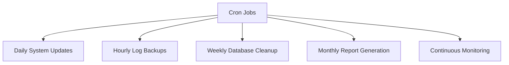

# Lecture 6: Automating Linux Tasks with Cron

## 1. Introduction to cron/crontab (15 minutes) ⏰

### 1.1 What is cron?

Cron is a time-based job scheduler in Unix-like operating systems. It enables users to schedule jobs (commands or shell scripts) to run periodically at fixed times, dates, or intervals.

### 1.2 Key Components

- **cron daemon**: The background service that runs scheduled tasks
- **crontab**: A configuration file containing the schedule of cron entries to be run

### 1.3 Advantages of Using cron

1. Automation of repetitive tasks
2. Scheduled execution without manual intervention
3. Improved system maintenance and administration
4. Efficient resource utilization by scheduling tasks during off-peak hours

## 2. Scope of crontab (10 minutes) 🔍

### 2.1 User-level crontabs

- Each user can have their own crontab
- Managed using the `crontab` command
- Typically stored in `/var/spool/cron/crontabs/`

### 2.2 System-wide crontab

- Located at `/etc/crontab`
- Used for system-wide tasks
- Requires root access to modify

### 2.3 cron.d directory

- Located at `/etc/cron.d/`
- Contains multiple crontab files
- Each file can have a different format and run as a different user

## 3. Use Cases of crontab (15 minutes) 💼

### 3.1 Common crontab use cases

1. System maintenance (e.g., log rotation, temp file cleanup)
2. Backups and data synchronization
3. Automated reporting and data processing
4. Monitoring and alerts
5. Scheduled application tasks (e.g., sending emails, updating databases)

### 3.2 Example Scenarios



## 4. Understanding crontab Syntax (20 minutes) 📝

### 4.1 Basic crontab format

```
* * * * * command_to_execute
│ │ │ │ │
│ │ │ │ └─── Day of the week (0 - 7) (Sunday = 0 or 7)
│ │ │ └───── Month (1 - 12)
│ │ └─────── Day of the month (1 - 31)
│ └───────── Hour (0 - 23)
└─────────── Minute (0 - 59)
```

### 4.2 Special characters in crontab

- `*`: Any value
- `,`: Value list separator
- `-`: Range of values
- `/`: Step values
- `@yearly`, `@monthly`, `@weekly`, `@daily`, `@hourly`: Shorthand for common schedules

### 4.3 Examples of cron schedules

1. Run every minute: `* * * * *`
2. Run every hour at 30 minutes past the hour: `30 * * * *`
3. Run at 2:15 PM every day: `15 14 * * *`
4. Run every Monday at 9 AM: `0 9 * * 1`
5. Run at midnight on the first day of every month: `0 0 1 * *`

## 5. Writing Your Own Cron Tasks (20 minutes) 👨‍💻

### 5.1 Steps to create a cron job

1. Open the crontab editor: `crontab -e`
2. Choose your preferred text editor (e.g., nano, vim)
3. Add your cron job entry
4. Save and exit the editor

### 5.2 Best practices for cron jobs

1. Use absolute paths for commands and scripts
2. Redirect output to log files for debugging
3. Use appropriate scheduling to avoid resource conflicts
4. Set a proper PATH at the beginning of the crontab
5. Use comments to describe the purpose of each job

### 5.3 Example crontab entries

```bash
# Daily backup at 1 AM
0 1 * * * /usr/local/bin/backup_script.sh > /var/log/backup.log 2>&1

# Run system updates every Sunday at 3 AM
0 3 * * 0 /usr/bin/apt-get update && /usr/bin/apt-get -y upgrade

# Generate monthly report on the 1st of every month at 7 AM
0 7 1 * * /home/user/scripts/generate_monthly_report.sh

# Check disk usage every 6 hours
0 */6 * * * /home/user/scripts/check_disk_usage.sh
```

## 6. Editing and Managing Crontab Tasks (15 minutes) 🛠️

### 6.1 Crontab commands

- `crontab -e`: Edit the current user's crontab
- `crontab -l`: List the current user's crontab contents
- `crontab -r`: Remove the current user's crontab
- `crontab -u username`: Specify a user's crontab to edit (requires root)

### 6.2 Updating existing cron jobs

1. Open the crontab editor
2. Locate the job you want to modify
3. Make necessary changes to the schedule or command
4. Save and exit the editor

### 6.3 Troubleshooting cron jobs

1. Check system logs: `grep CRON /var/log/syslog`
2. Ensure proper permissions for scripts and directories
3. Verify the cron daemon is running: `systemctl status cron`
4. Use `run-parts` to test scripts in cron directories

## 7. Practical Exercise: Implementing Automated Tasks (20 minutes) 🏋️

Let's implement some of the automation scripts from previous lectures as cron jobs.

### 7.1 Log Rotation Cron Job

```bash
# Add to crontab
0 0 * * * /home/user/scripts/log_archiver.sh
```

### 7.2 Database Backup Cron Job

```bash
# Add to crontab
0 1 * * * /home/user/scripts/mysql_backup.sh
```

### 7.3 Disk Usage Check Cron Job

```bash
# Add to crontab
0 */4 * * * /home/user/scripts/disk_usage_check.sh
```

### 7.4 Web Server Uptime Check Cron Job

```bash
# Add to crontab
*/5 * * * * /home/user/scripts/webserver_uptime_check.sh
```

## Conclusion and Course Wrap-up (5 minutes)

In this final lecture, we've explored how to use cron to schedule and automate the execution of tasks in Linux systems. We've covered the basics of cron, its syntax, and how to create and manage cron jobs. By implementing the automation scripts from previous lectures as cron jobs, we've tied together the concepts of automation and scheduling in DevOps practices.

Throughout this course, we've covered:
1. Introduction to Automation and the Software Delivery Pipeline
2. Continuous Delivery Pipeline and Automated Processes
3. Rapid Application Development (RAD) and Code Generation
4. Advantages of Automation and Various Automation Scenarios
5. Automating Linux Tasks with Cron

These concepts and practices form the foundation of DevOps automation and continuous monitoring. As you move forward, continue to explore new automation opportunities and stay updated with the latest tools and practices in the field.

## Additional Resources

- Book: "Linux Crontab: A Comprehensive Guide" by Michael W. Lucas
- Article: "A Beginners Guide To Cron Jobs" on OSTechNix
- Video: "Cron Jobs Tutorial" on LinuxHint YouTube channel
- Online Course: "Linux Automation with Bash Scripting and Cron Jobs" on Udemy

